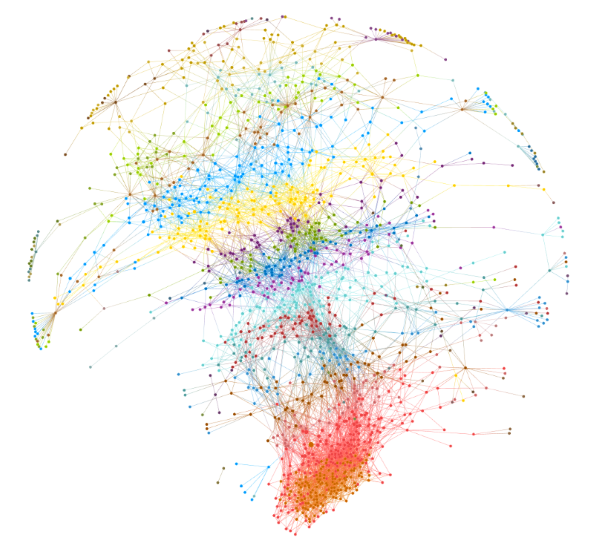

# Social Network Analysis 

Hi! Current repo contains materials for course **Social Network Analysis**: presentations, practice and hw notebooks. 

Week # | Lecture video | Additional materials 
--- | --- | --- 
1 | [Intro. Terminology](https://youtu.be/mdW3b9jcO6I)  |  
2 | [Random graph. Descriptive network analysis](https://youtu.be/bRDyjRpITV0)|

### Old video (20-21 years, branch - master)
- [Week 1. Intro & Overview. Nodes, edges. Main graph types](https://www.youtube.com/watch?v=0-qKgkPTuA8)
- [Week 2. Descriptive network analysis](https://www.youtube.com/watch?v=BwSSZ6G10zA)
- [Week 3. Mathematical models of networks. Node centrality and ranking on networks](https://www.youtube.com/watch?v=UqiS64BQGpI)
- [Week 4. Network communities](https://www.youtube.com/watch?v=2IgKdUukmqk)
- [Week 5. Network structure and visualization](https://www.youtube.com/watch?v=nK9Sm-Xihwg) 
- [Week 6. SI-, SIS-, SIR- models](https://youtu.be/12L63iX4Hxo) 

